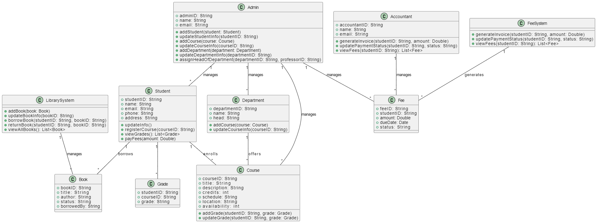

# UML CLASS DIAGRAM

---

## Introduction

Introduction to Class Diagram:
A Class Diagram is a type of structural diagram used in the Unified Modelling Language [`UML`](https://en.wikipedia.org/wiki/Unified_Modeling_Language) This type of diagram focuses on the visualization of objects (Classes) and the connections between them, such as Inheritance or Aggregation. The diagram represents the system's Classes, __`Attributes`__, and __`Methods`__, as well as the __`Relationships`__ that connect these objects to each other.


## Class Diagram Components

Classes: Represent the basic objects of the system that contain properties and methods:

- __`Attributes`__: These are the values or variables that an object holds.
- __`Methods`__: These are the functions that a class can implement.
- __`Relationships`__: Represent how classes are related to each other.

---

## Scenario

Imagine that we have a university system to manage the library, students, departments, courses, and fees. The role of the Class Diagram is to show all the classes involved in this system and how they interact with each other. This diagram can be used by developers to understand the relationships between the different components of the system before they start coding.

---

- [UML CLASS DIAGRAM](#uml-class-diagram)
  - [Introduction](#introduction)
  - [Class Diagram Components](#class-diagram-components)
  - [Scenario](#scenario)
  - [1. Admin Class](#1-admin-class)
    - [Attributes](#attributes)
    - [Operations](#operations)
    - [Relationships](#relationships)
  - [2. Student Class](#2-student-class)
    - [Attributes](#attributes-1)
    - [Operations](#operations-1)
    - [relationships](#relationships-1)
  - [3. Department Class](#3-department-class)
    - [Attributes](#attributes-2)
    - [Operations](#operations-2)
    - [Relationships](#relationships-2)
  - [4. Course Class](#4-course-class)
    - [Attributes](#attributes-3)
    - [Operations](#operations-3)
    - [Relationships](#relationships-3)
  - [5. LibrarySystem Class](#5-librarysystem-class)
    - [Operations](#operations-4)
    - [Relationships](#relationships-4)
  - [6. Book Class](#6-book-class)
    - [Attributes](#attributes-4)
    - [Relationships](#relationships-5)
  - [7. FeeSystem Class](#7-feesystem-class)
    - [Operations](#operations-5)
    - [Relationships](#relationships-6)
  - [8. Fee Class](#8-fee-class)
    - [Attributes](#attributes-5)
    - [Relationships](#relationships-7)
  - [9. Accountant Class](#9-accountant-class)
    - [Attributes](#attributes-6)
    - [Operations](#operations-6)
    - [Relationships](#relationships-8)
  - [Plain Text Diagrams Classes](#plain-text-diagrams-classes)
  - [Class Admin](#class-admin)
  - [__Class Course__](#class-course)
  - [__Class Grade__](#class-grade)
  - [__Class LibrarySystem__](#class-librarysystem)
  - [__Class Book__](#class-book)
  - [__Class Department__](#class-department)
  - [__Class FeeSystem__](#class-feesystem)
  - [__Class Accountant__](#class-accountant)
  - [All Classes Plain Text](#all-classes-plain-text)
  - [Conclusion](#conclusion)
  - [__Contribute__](#contribute)



-__adminID__: Unique identifier for theadmin (String).
- __name__: Name of the admin (String).
- __email__: Email address of the admin (String).

### operations

- `addStudent(student:Student)`: Adds a new student to the system.
- `updateStudentInfo(studentID:String)`: Updates the information of a student based on their studentID.
- `addCourse(course:Course)`: Adds a new course to the system.
- `updateCourseInfo(courseID:String)`: Updates the information of a specific course.
- `addDepartment(department:Department)`: Adds a new department to the system.
- `updateDepartmentInfo(departmentID:String)`:Updates the setails of an existing department.
- `assignHeadOfDepartment(departmentID:String, professorID: String)`: Assigns a professor as the head of a specific department.

- __Manages__:
  - The `Admin` manages:
    - `Student`
    - `Course`
    - `Department`
   
---
         
- __studentID__: Unique identifier for the student(String).
- __name__: Name of the student(String).
- __email__: Email address of the student(string).
- __phone__: Contact number of the student(String).
- __address__: Address of the student(String).


- `updateInfo()`: Allows the student to update their personal information.
- `registerCourse(courseID: String)`: Enables the student to enroll in a specific course.
- `viewGrades(): List<Grade>`: Provides the student with a list of their grades.
- `payFees(amount:Double)`: Allows the student to pay their fees.


- __Borrows__:
  - The `Student` borrows books from the `LibrarySystem`.
- __Enrolled in__:
  - The `Student` enrolls in courses offered by the `Department`.
 


- __departmentID__: Unique identifier for the department (String).
- __name__: Name of the department (String).
- __head__: Head of the department (String).


- `addCourse(course: Course)`: Adds a new course to the department.
- `updateCourseinfo(courseID:String)`: Updates the information of an existing course.


- __Manages__:
  - The `Department` manages:
    - `Course`
    - Offers courses that students can enroll in.
  
 


 


 Fee Class

### Attributes

- __feeID__: Unique identifier for the fee (String).
- __studentID__: Unique identifier of the student who is charged (String).
- __amount__: Amount of the fee (Double).
- __dueDate__: The due date for fee payment (Date).
- __status__: The current payment status (String).

### Relationships

- __Managed by__
  - The `Fee` is managed by the `FeeSystem`, which is responsible for generating and updating fee details.

---

## 9. Accountant Class

### Attributes

- __accountantID__: Unique identifier for the accountant (String).
- __name__: Name of the accountant (String).
- __email__: Email address of the accountant (String).

### Operations

- `generateInvoice(studentID: String, amount: Double)`: Generates an invoice for a student.
- `updatePaymentStatus(studentID: String, status: String)`: Updates the payment status for a student.
- `viewFees(studentID: String): List<Fee>`: Allows the accountant to view the list of fees for a student.

### Relationships

- __Manages__
  - The `Accountant` manages the `FeeSystem` by generating and updating fee information.

---

## Plain Text Diagrams Classes

```c++
class Student {
    +studentID: String
    +name: String
    +email: String
    +phone: String
    +address: String
    +updateInfo()
    +registerCourse(courseID: String)
    +viewGrades(): List<Grade>
    +payFees(amount: Double)
}
```
## Class Admin

```c++
class Admin {
    +adminID: String
    +name: String
    +email: String
    +addStudent(student: Student)
    +updateStudentInfo(studentID: String)
    +addCourse(course: Course)
    +updateCourseInfo(courseID: String)
    +addDepartment(department: Department)
    +updateDepartmentInfo(departmentID: String)
    +assignHeadOfDepartment(departmentID: String, professorID: String)
}
```

## __Class Course__

```c++
class Course {
    +courseID: String
    +title: String
    +description: String
    +credits: int
    +schedule: String
    +location: String
    +availability: int
    +addGrade(studentID: String, grade: Grade)
    +updateGrade(studentID: String, grade: Grade)
}
```

## __Class Grade__

```c++
class Grade {
    studentID: String
    courseID: String
    grade: String
}
```

## __Class LibrarySystem__

```c++
class LibrarySystem {
    +addBook(book: Book)
    +updateBookInfo(bookID: String)
    +borrowBook(studentID: String, bookID: String)
    +returnBook(studentID: String, bookID: String)
    +viewAllBooks(): List<Book>
}
```


##__Class Accountant__

```c++
class Accountant {
    +accountantID: String
    +name: String
    +email: String
    +generateInvoice(studentID: String, amount: double)
    +updatePaymentStatus(studentID: String ,status: String)
    +viewFees(studentID: String): list<fee>
}
```
## All Classes Plain Text

```yml
@startuml
class Student {
    studentID: String
    name: String
    email: String
    phone: String
    address: String
    updateInfo()
    registerCourse(courseID: String)
    viewGrades(): List<Grade>
    payFees(amount: Double)
}
class Admin {
    adminID: String
    name: String
    email: String
    addStudent(student: Student)
    updateStudentInfo(studentID: String)
    addcourse(course: Course)
    updateCourseInfo(courseID: String)
    addDepartment(department: Department)
    updateDepartmentInfo(departmentID: String)
    assignHeadOfDepartment(departmentID: String, professorID: String)
}
class Course {
    courseID: String
    title: String
    description: String
    credits: int
    schedule: String
    location: String
    availability: int
    addGrade(studentID: String, grade: Grade)
    updateGrade(studentID: String, grade: Grade)
}

class Grade {
    studentID: String
    courseID: String
    grade: String
}

class LibrarySystem {
    addBook(book: Book)
    updateBookInfo(bookID: String)
    borrowBook(studentID: String, bookID: String)
    returnBook(studentID: String, bookID: String)
    viewAllBooks(): List<Book>
}
